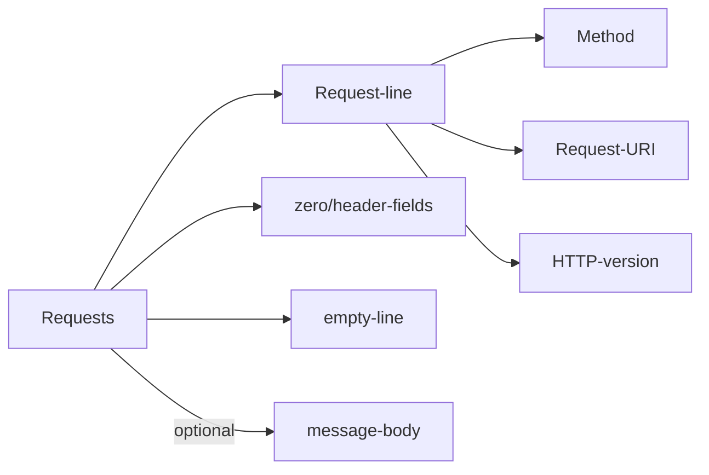
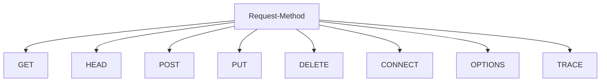
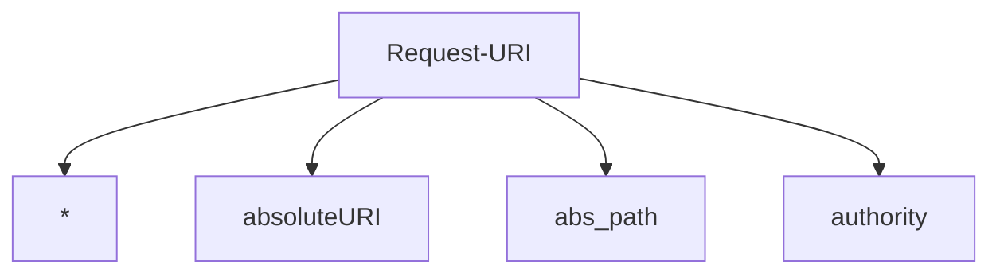

# HTTP NOTES     

## FEATURES  
### Architecture
based on __Client-Server__ Architecture


## Parameters


### HTTP Version
**syntax**  
`HTTP-Version   = "HTTP" "/" 1*DIGIT "." 1*DIGIT`

#### Example
`HTTP/1.0`  

#### Uniform Resource Identifiers(URI)
**syntax**  
`URI = "http:" "//" host [ ":" port ] [ abs_path [ "?" query ]]`    
_port_can be not given, default: 80     
_characters_are equivalent to their""%" HEX HEX" encoding.

#### Example
```
http://abc.com:80/~smith/home.html
http://ABC.com/%7Esmith/home.html
http://ABC.com/%7Esmith/home.html
```

### Date/Time Formats
_be represented in Greenwich Mean Time (GMT)_

### Character Sets
_default: ASCII_  

### Content Encodings
_gzip/compress/deflate_
#### Example
`Accept-encoding: gzip`

### Media Types
*Content-Type and Accept header fields*
`Accept: images/gif`

### Language Tags
*Accept-language and Content-Language fields*
`en-US, en-cockney`

## Messages
**generic message format:**

>    + A Start-line
>    + Zero or more header fields followed by CRLF
>    + An empty line (i.e., a line with nothing preceding the CRLF) 
>    indicating the end of the header fields
>    + Optionally a message-body

### Example:
HTTP request to fetch **t.html** page that does not exist on the web server running on _tutorialspoint.com_.    
#### Client request
```
GET /**t.html** HTTP/1.1
User-Agent: Mozilla/4.0 (compatible; MSIE5.01; Windows NT)
Host: www.tutorialspoint.com
Accept-Language: en-us
Accept-Encoding: gzip, deflate
Connection: Keep-Alive
```

#### Server response

```
HTTP/1.1 404 Not Found
Date: Sun, 18 Oct 2012 10:36:20 GMT
Server: Apache/2.2.14 (Win32)
Content-Length: 230
Content-Type: text/html; charset=iso-8859-1
Connection: Closed
```

```html
<!DOCTYPE HTML PUBLIC "-//IETF//DTD HTML 2.0//EN">          
<html>  
<head>  
    <title>404 Not Found</title>  
</head>  

<body>
    <h1>Not Found</h1>
    <p>The requested URL /t.html was not found on this server.</p>  
</body>  
</html>
```
---
### Message Start-Line
**basic format:**       

    start-line = Request-Line | Status-Line

_Request-line_ sent by the **client**    
_Status-Line_ sent by the **server**

### Message Header Fields
_header fields provide required information about the request or response, about the object sent in the message body._ 

>- **General-header:** These header fields have general applicability for both `request` and `response` messages.
>- **Request-header:** These header fields have applicability only for request messages. 
>- **Response-header:** These header fields have applicability only for response messages. 
>- **Entity-header:**  These header fields define **meta information** about the `entity-body` or, if no body is present, about the resource identified by the `request`.

#### Example
```
User-Agent: curl/7.16.3 libcurl/7.16.3 OpenSSL/0.9.7l zlib/1.2.3
Host: www.example.com
Accept-Language: en, mi
Date: Mon, 27 Jul 2009 12:28:53 GMT
Server: Apache
Last-Modified: Wed, 22 Jul 2009 19:15:56 GMT
ETag: "34aa387-d-1568eb00"
Accept-Ranges: bytes
Content-Length: 51
Vary: Accept-Encoding
Content-Type: text/plain
```

### Message Body
**optional part**
#### Example
*another way, just like this `body`*??
```html
<html>
   <body>
   
      <h1>Hello, World!</h1>
   
   </body>
</html>
```

## Requests   
**basic format:**   

>    - A Request-line
>    - Zero or more header (General|Request|Entity) fields followed by CRLF
>    - An empty line (i.e., a line with nothing preceding the CRLF) 
>   indicating the end of the header fields 
>    - Optionally a message-body  



### Request-line        

*The Request-Line begins with a method token, followed by the Request-URI and the protocol version, and ending with CRLF.*    

**syntax**  
    
    Request-Line = Method SP Request-URI SP HTTP-Version CRLF


------------    

| S.N.     | Method and Description                                                                                                                                                                   |
| :------: | :------------------------                                                                                                                                                                |
| 1        | __GET__            The GET method is used to retrieve information from the given server using a given URI. Requests using GET should only retrieve data and should have no other effect on the data. |
| 2        | __HEAD__           Same as GET, but it transfers the status line and the header section only.                                                                                                           |
| 3        | __POST__           A POST request is used to send data to the server, for example, customer information, file upload, etc. using HTML forms.   |
|   4      | __PUT__            Replaces all the current representations of the target resource with the uploaded content. |
| 5 |   __DELETE__         Removes all the current representations of the target resource given by URI.
|6 | __CONNECT__        Establishes a tunnel to the server identified by a given URI.
|7|__OPTIONS__        Describe the communication options for the target resource.|
| 8| __TRACE__          Performs a message loop back test along with the path to the target resource.|
    
#### Request-URI
    
-------         
__format__      
_Request-URI = "*" | absoluteURI | abs_path | authority_    



S.N.  |  Method and Description     
----- | -------   
1  | The asterisk * is used when an HTTP request does not apply to a particular resource, but to the server itself, and is only allowed when the method used does not necessarily apply to a resource. For example:<br>__OPTIONS * HTTP/1.1__|
2 | The absoluteURI is used when an HTTP request is being made to a proxy. The proxy is requested to forward the request or service from a valid cache, and return the response. For example: <br>__GET      http://www.w3.org/pub/WWW/TheProject.html HTTP/1.1__| 
3 | The most common form of Request-URI is that used to identify a resource on an origin server or gateway. For example, a client wishing to retrieve a resource directly from the origin server would create a TCP connection to port 80 of the host "www.w3.org" and send the following lines:<br>__GET /pub/WWW/TheProject.html HTTP/1.1 Host: www.w3.org__ <br>*Note that the absolute path cannot be empty; if none is present in the original URI, it MUST be given as "/" (the server root).*

---

### Request Header Fields

The request-header fields allow the client to **pass** _additional information about the request_, and _about the client itself_, **to the server**. 
These fields act as request modifiers.


 -   Accept-Encoding
    
-   Accept-Language
    
-   Authorization
    
-   Expect
    
-   From
    
-   Host
    
-   If-Match
    
-   If-Modified-Since
    
-   If-None-Match
    
-   If-Range
    
-   If-Unmodified-Since
    
-   Max-Forwards
    
-   Proxy-Authorization
    
-   Range
    
-   Referer
    
-   TE
    
-   User-Agent  
    
----

### Examples of Request Message

Now let's put it all together to form an HTTP request to *fetch **hello.htm** page* from the web server running on tutorialspoint.com

    GET /hello.htm HTTP/1.1                                     Request-line
    User-Agent: Mozilla/4.0 (compatible; MSIE5.01; Windows NT)  Headers
    Host: www.tutorialspoint.com                                Headers
    Accept-Language: en-us                                      Headers
    Accept-Encoding: gzip, deflate                              Headers
    Connection: Keep-Alive                                      Headers

---
*send form data to the server using request message body:*      

    
    POST /cgi-bin/process.cgi HTTP/1.1
    User-Agent: Mozilla/4.0 (compatible; MSIE5.01; Windows NT)
    Host: www.tutorialspoint.com
    Content-Type: application/x-www-form-urlencoded
    Content-Length: length
    Accept-Language: en-us
    Accept-Encoding: gzip, deflate
    Connection: Keep-Alive

    licenseID=string&content=string&/paramsXML=string

---
*pass plain XML to your web server:*
    
    POST /cgi-bin/process.cgi HTTP/1.1
    User-Agent: Mozilla/4.0 (compatible; MSIE5.01; Windows NT)
    Host: www.tutorialspoint.com
    Content-Type: text/xml; charset=utf-8
    Content-Length: length
    Accept-Language: en-us
    Accept-Encoding: gzip, deflate
    Connection: Keep-Alive

    <?xml version="1.0" encoding="utf-8"?>
    <string xmlns="http://clearforest.com/">string</string>
---

## Responses

**basic format:**       
>-   A Status-line
>-   Zero or more header (General|Response|Entity) fields followed by CRLF
>-   An empty line (i.e., a line with nothing preceding the CRLF) indicating the end of the header fields
>-   Optionally a message-body      

---

### Status-Line 

**format:**     
    
Status-Line = **HTTP-Version** SP **Status-Code** SP **Reason-Phrase** CRLF     
### Status Code 
The Status-Code element is a 3-digit integer where *first* digit of the Status-Code defines the class of response and the *last two* digits do not have any categorization role.        

S.N. | Code and Description
---|---
1 | **1xx: Informational**  It means the request was received and the process is continuing.
2 |**2xx: Success** It means the action was successfully received, understood, and accepted.
3 | **3xx: Redirection** It means further action must be taken in order to complete the request.
4 | **4xx: Client Error** It means the request contains incorrect syntax or cannot be fulfilled.
5 | **5xx: Server Error** It means the server failed to fulfill an apparently valid request.

---
### Response Header Fields

The response-header fields allow the server to pass additional information about the response which cannot be placed in the Status- Line.       

-   Accept-Ranges
    
-   Age
    
-   ETag
    
-   Location
    
-   Proxy-Authenticate
    
-   Retry-After
    
-   Server
    
-   Vary
    
-   WWW-Authenticate        

---
### Examples of Response Message

The following example shows an HTTP response message displaying error condition when the web server could not find the requested page:      
```
HTTP/1.1 404 Not Found
Date: Sun, 18 Oct 2012 10:36:20 GMT
Server: Apache/2.2.14 (Win32)
Content-Length: 230
Connection: Closed
Content-Type: text/html; charset=iso-8859-1
```

```html
<!DOCTYPE HTML PUBLIC "-//IETF//DTD HTML 2.0//EN">  
<html>
<head>
    <title>404 Not Found</title>
</head>
<body>
      <h1>Not Found</h1>
        <p>The requested URL /t.html was not found on this server</p>
</body>
</html>
```
--- 
## HTTP Header Fields

```mermaid
graph LR
a[HTTP Header Fields] --> b[General-header]
a[HTTP Header Fields] --> c[Client Request-header]
a[HTTP Header Fields] --> d[Server Response-header]
a[HTTP Header Fields] --> e[Entity-header]
b[General-header] --> b1[Cache-Control]
b[General-header] --> b2[Connection]
b[General-header] --> b3[Date]
b[General-header] --> b4[Pragma]
b[General-header] --> b5[Trailer]
b[General-header] --> b6[Transfer-Encoding]
b[General-header] --> b7[Upgrade]
b[General-header] --> b8[Via]
b[General-header] --> b9[Warning]
c[Client Request-header] --> c1[Accept]
c[Client Request-header] --> c2[Accept-Charset]
c[Client Request-header] --> c3[Accept-Encoding]
c[Client Request-header] --> c4[Accept-Language]
c[Client Request-header] --> c5[Authorization]
c[Client Request-header] --> c6[Cookie]
c[Client Request-header] --> c7[Expect]
c[Client Request-header] --> c8[From]
c[Client Request-header] --> c9[Host]
c[Client Request-header] --> c10[If-Match]
c[Client Request-header] --> c11[If-Modified-Since]
c[Client Request-header] --> c12[If-None-Match]
c[Client Request-header] --> c13[If-Range]
c[Client Request-header] --> c14[If-Unmodified-Since]
c[Client Request-header] --> c15[Max-Forwards]
c[Client Request-header] --> c16[Proxy-Authorization]
c[Client Request-header] --> c17[Range]
c[Client Request-header] --> c18[Referer]
c[Client Request-header] --> c19[TE]
c[Client Request-header] --> c20[User-Agent]
d[Server Response-header] --> d1[Accept-Ranges]
d[Server Response-header] --> d2[Age]
d[Server Response-header] --> d3[ETag]
d[Server Response-header] --> d4[Location]
d[Server Response-header] --> d5[Proxy-Authenticate]
d[Server Response-header] --> d6[Retry-After]
d[Server Response-header] --> d7[Server]
d[Server Response-header] --> d8[Set-Cookie]
d[Server Response-header] --> d9[Vary]
d[Server Response-header] --> d10[WWW-Authenticate]
e[Entity-header] --> e1[Allow]
e[Entity-header] --> e2[Content-Encoding]
e[Entity-header] --> e3[Content-Language]
e[Entity-header] --> e4[Content-Length]
e[Entity-header] --> e5[Content-Location]
e[Entity-header] --> e6[Content-MD5]
e[Entity-header] --> e7[Content-Range]
e[Entity-header] --> e8[Content-Type]
e[Entity-header] --> e9[Expires]
e[Entity-header] --> e10[Last-Modified]
```


### Cookie
The user agent includes stored cookies in the Cookie HTTP request
   header.

   When the user agent generates an HTTP request, the user agent MUST
   NOT attach more than one Cookie header field.

   A user agent MAY omit the Cookie header in its entirety.  For
   example, the user agent might wish to block sending cookies during
   "third-party" requests from setting cookies (see [Section 7.1](https://tools.ietf.org/html/rfc6265#section-7.1)).

   If the user agent does attach a Cookie header field to an HTTP
   request, the user agent MUST send the cookie-string (defined below)
   as the value of the header field.

   The user agent MUST use an algorithm equivalent to the following
   algorithm to compute the "cookie-string" from a cookie store and a
   request-uri:

   1.  Let cookie-list be the set of cookies from the cookie store that
       meets all of the following requirements:

       *  Either:

             The cookie's host-only-flag is true and the canonicalized
             request-host is identical to the cookie's domain.

          Or:

             The cookie's host-only-flag is false and the canonicalized
             request-host domain-matches the cookie's domain.

       *  The request-uri's path path-matches the cookie's path.

       *  If the cookie's secure-only-flag is true, then the request-
          uri's scheme must denote a "secure" protocol (as defined by
          the user agent).

             NOTE: The notion of a "secure" protocol is not defined by
             this document.  Typically, user agents consider a protocol
             secure if the protocol makes use of transport-layer  
             security, such as SSL or TLS.  For example, most user
             agents consider "https" to be a scheme that denotes a
             secure protocol.

       *  If the cookie's http-only-flag is true, then exclude the
          cookie if the cookie-string is being generated for a "non-
          HTTP" API (as defined by the user agent).

   2.  The user agent SHOULD sort the cookie-list in the following
       order:

       *  Cookies with longer paths are listed before cookies with
          shorter paths.

       *  Among cookies that have equal-length path fields, cookies with
          earlier creation-times are listed before cookies with later
          creation-times.

       NOTE: Not all user agents sort the cookie-list in this order, but
       this order reflects common practice when this document was
       written, and, historically, there have been servers that
       (erroneously) depended on this order.

   3.  Update the last-access-time of each cookie in the cookie-list to
       the current date and time.

   4.  Serialize the cookie-list into a cookie-string by processing each
       cookie in the cookie-list in order:

       1.  Output the cookie's name, the %x3D ("=") character, and the
           cookie's value.

       2.  If there is an unprocessed cookie in the cookie-list, output
           the characters %x3B and %x20 ("; ").

   NOTE: Despite its name, the cookie-string is actually a sequence of
   octets, not a sequence of characters.  To convert the cookie-string
   (or components thereof) into a sequence of characters (e.g., for
   presentation to the user), the user agent might wish to try using the
   UTF-8 character encoding  [RFC3629](https://tools.ietf.org/html/rfc3629 "UTF-8, a transformation format of ISO 10646")  to decode the octet sequence.
   This decoding might fail, however, because not every sequence of
   octets is valid UTF-8.
   
--- 

## Reference:
[HTTP Tutorial](https://www.tutorialspoint.com/http/index.htm)    
[Hypertext Transfer Protocol -- HTTP/1.1](https://www.w3.org/Protocols/rfc2616/rfc2616.html)    
[The Cookie Header](https://tools.ietf.org/html/rfc6265#section-5.4)    

